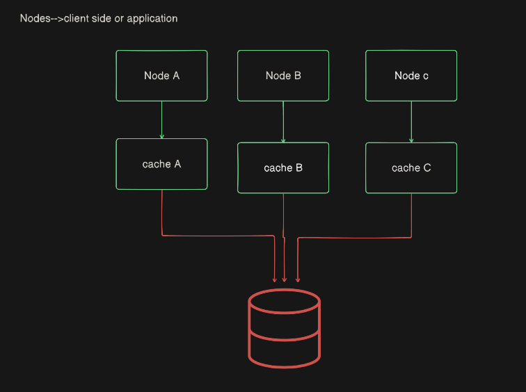
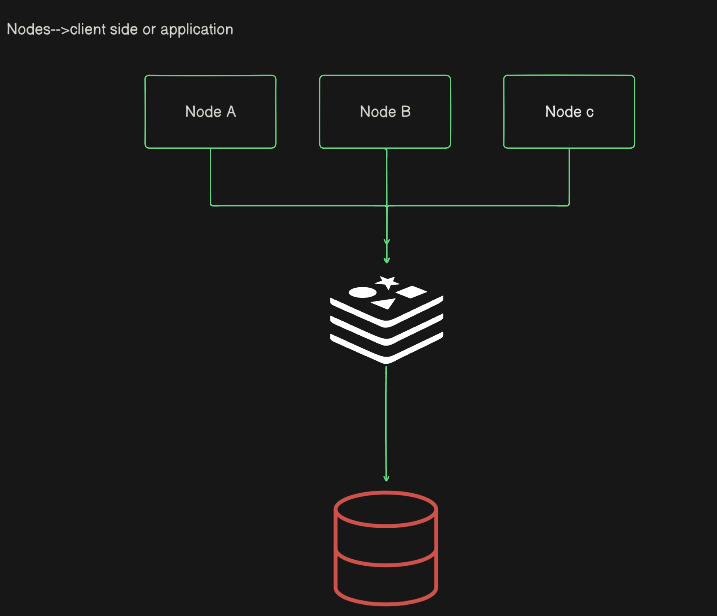

# Caching:

💡Storing frequently accessed data into some other storage system so that everytime the sa,e data is accessed we do not hit the db multiple times 
🚀 Thus increasing the response speed, and also making it efficient as db operations are costly

## Why use Caching?
- Reduce latency:Faster access to data comapred o fetching from a db or external service
- Decrease Load: Reduces the number of calls to the backend system or database
- Improve scalability: Helps application handle higher traffic loads efficiently

## Types of Caching:
1. In-memory caching--> 
    - Here we store the info in the RAM rather than hardisk or ssd..since fetching data from ram is faster near about nanoseconds of task
    - It by default uses ConcurrentHashMap to store the frequently accessed data
    However these is a disadvantage for in-memory cache...Each instance has its own cache all of which are finally connected to the db..
    -Suppose there is a situation node a fails , then application send the request from node b(horizontal scaling)....
        - and we had made a change to the node A previously..which isn't update in the other caches of the other nodes...since they are different...
        - leading to data inconsistency



2. Distributed caching-->it uses a central cache ..hence we get the updated value of the info even if we visit from different instances



## Cache in spring boot

1. First of all , we need to enable caching in the spring boot  project...by using ```@EnableCaching``` Annotation
    - Need to configure ..let's make it inside config or the main @Springbootapplication....anywhere whereever configuration is present
2. then in order to cache the result/output of the particular method/function we puit ```@Cacheable``` annotation over the function
3. suppose we update the db by changing a part of the info...but the frequently used data which is still inside the cache gives the previous output itse;f...that means the cache is not sync with thr db leading to data inconsistency..
    - so on the  method which updates the value of the info in the db....we put ```CachePut(table_name)``` Annotation
4. Suppose we want to update the data, so we do the changes and trigger the update endpoint which makes the changes to the db...but still there is the previous data in the  cache ..so we need to update the cache contents as well ...hance we would use ```CachePut(table_name)``` Annotation
    *N.B.: Cacheput by default adds a new entry to the cache db instead of updating it..so add consistent key to the caches so that it updates if the data of the same key*
5. If I delete a data from the db , then we need to delete it from the cache as well else it will lead to data inconsistency...hence ```CacheEvict(table_name)``` annotation comes to the rescue

## Using Redis as A cache
1. First of all we need to setup the RedisTemplate , with which we set up the redis configuration
    - We require the RedisConnectionFactory(an interface) which helps making a connection to the redis server
2. Then comes the main logic for caching...we will get the response from the cache , if the cache response is null[which means the cache memory is empty] , then we will hit the db and fetch the data
    - If the data fetchd from the db is available i.e. not null then go ahead and save it to the cache db
