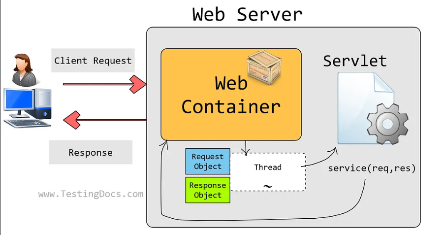
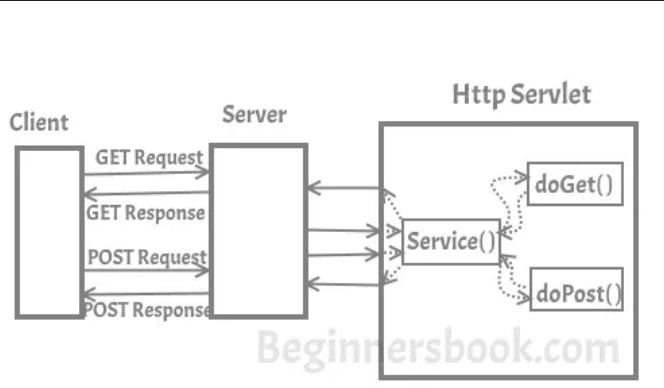

# 🚀Spring Boot Web

---

### 💡Spring Boot Web behind the scene uses Servlet

Before I start explaining how the servlet works, lets get familiar with these three terms.

- Web Server: it can handle HTTP Requests send by clients and responds the request with an HTTP Response.

- Web Application(webapp): I would refer this as webapp in this guide. Basically the project is your web application, it is the collection of servlets.

- Web Container: Also known as Servlet Container and Servlet Engine. It is a part of Web Server that interacts with Servlets. This is the main component of Web Server that manages the life cycle of Servlets.

## How Servlet Works?
1) When the web server (e.g. Apache Tomcat) starts up, the servlet container deploy and loads all the servlets. During this step Servlet container creates ServletContext object. ServletContext is an interface that defines the set of methods that a servlet can use to communicate with the servlet container.

    Note: There is only one ServletContext per webapp which is common to all the servlets. ServletContext has several useful methods such as addListener(), addFilter() etc. For now I am not explaining them as I will cover them in a separate text about ServletContext.

2) Once the servlet is loaded, the servlet container creates the instance of servlet class. For each instantiated servlet, its init() method is invoked.

3) Client (user browser) sends an Http request to web server on a certain port. Each time the web server receives a request, the servlet container creates HttpServletRequest and HttpServletResponse objects. The HttpServletRequest object provides the access to the request information and the HttpServletResponse object allows us to format and change the http response before sending it to the client.

The servlet container spawns a new thread that calls service() method for each client request. The service() method dispatches the request to the correct handler method based on the type of request.
For example if server receives a Get Request the service() method would dispatch the request to the doGet() method by calling the doGet() method with request parameters. Similarly the requests like Post, Head, Put etc. are dispatched to the corresponding handlers doPost(), doHead(), doPut() etc. by service() method of servlet.

### Libraries(dependencies) for implementing ServLet::(Just for information)

1. The jakarta Servlet api
2. The tomcat embed

## Introduction to MVC Architecture:(Flowwise--> CMV)
- Model(Pojo)-->The schema or the properties of the entities--> object in which we have our data is called the Model
                  
- View-->This is implemented by JSP(Jakarta Server Pages or Java Server Pages)..There are many other view technologies such as thymeleaf etc.
   
   - JSP returns the response to the client in the form of text or html..

- Controller(Servlet)--> This receives the client request .

