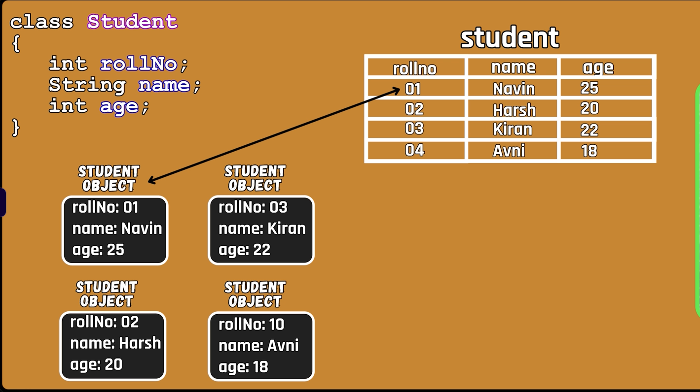

# Hibernate--> ORM[Object relational mapping framework]
  ORM--> It is a framework which helps to map the java class with the database table and java object with the database record.
  - It is a persistence framework and it is used to store the data in the database.
  - It is a framework which provides the implementation of the JPA(Java Persistence API) specification.

### As we can see here, the class is mapped to the Table in the DB
### And the objects get mapped to the DB record i.e. the data in each of the rows