# What is SQL?

💡Data is the most important aspect in today's scenario...Everything out there is mere data 
💡Companies generate large amount of data everyday ...

💡💡Hence we need something to access ,manage, view , manipulate and analyse the data ..
💡🚀 Here's where Database comes in ..
    Database is a container for storing data...it also organises the data so that we can access, manage and search tha data

🚀🚀SQL --> Structured Query Language comes into picture here...we interact and talk to the database with the help of SQL

## Types of Databases[5]:

1. SQL 
   - Relational DBMS--> Its like a multiple tables having numerous rows and columns and which are related to each other
   - eg: Microsoft SQL Server,MySQL ,PostGresSQL

2. NOSQL 
   - Key-Value DBMS-->Its more like a Dictionary..we have pairs of <key ,values> eg: Redis, AmazonDynamoDB
   - Columns based--> very advanced database eg: Apache Casssandra,Amazon Redshift
   - Graph Database-> Related between objects eg: Neo4J
   - Document database  eg: MongoDB


## SQl Commands:
1. Data Definition Language[DDL]:
   - This is used to define something in our DB..
   - DDL commands: CREATE  |  ALTER   |  DROP
2. Data Manipulation Language[DML]:
    - This is used to manipulate or rather do changes to the data in the database:
    - DML Commands: INSERT  |  UPDATE  |  DELETE
3. Data Query Language[DQL]:
    - We use it to query out db and the db returns the required results to us
    - DQL Command:  SELECT 
4. 

## SQL Query Commands:
1. SELECT 
2. FROM
3. WHERE --> used in order to filter data based on a condition  --> it comes in b/w from and group by
    Check where operators in github pdf...and check filtering.sql file
4. ORDER BY--> to sort ur data in either ascending or descending order
5. GROUP BY--> to apply any aggregate function on a table column...similar to group by in data analysis..
    - It aggregates a cokumns by another column
💡💡 Group by to be applied b/w ```where``` & ```order by```..since it comes in between them by order...
💡💡🚀 Group by rule:: All columns in the ```select``` must be either aggreagted or included in ```group by```
6. 💡 Having--> it is also used to filter data **<u>after Aggregation..can be used only after using group by</u>**
    *N.B.*: We use the having clause on the aggregated value ..

🚀🚀Both *where* and *having* are used to filter data..but they have a peak difference
Where --> it is used to filter data before the aggregation
Having--> it is used to filter data after the aggregation
💡💡 And if groupby exists..then the aggregation is done doen after the group by clause......and where is used b/w from and groupby..hence...

7. Distinct:->Remove duplicates from data hence ensures each value appears only once ..
    *N.B.:*: Don't use distinct unless very necessary...since it slows down your query..Its an expensive operation

8. Top(limit): It restricts the number of rows returned in the result..filters on the basis of row numbers

### 👇We write the commands in this sequence...                                 👇The commands are executed and interpreted in the following seq.
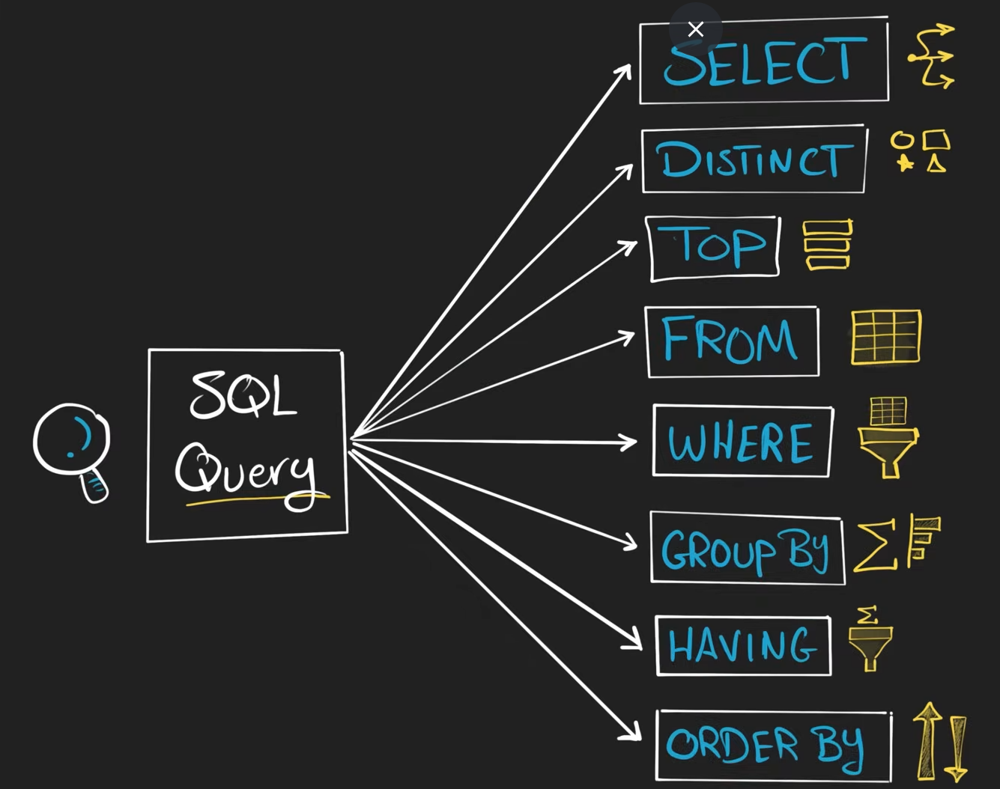                                                       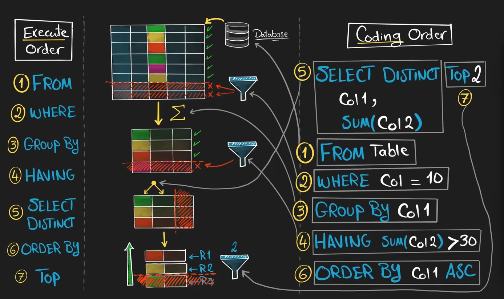


### Each command is used to do some kind of filtering on the data👇
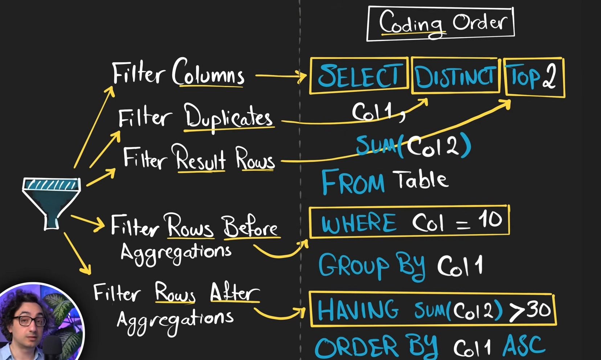

## DDL Commands: follow ddl_tut.sql

## DML Commands:
**1)i. Insert: we use it to insert into a table manually**
💡💡Syntax:
```SQL
INSERT INTO table_name (col1,col2,col3,col4...) VALUES (val1,val2,val3...)
```
*N.B.*: 1.We can ommit the list of columns..but then it will insert the values as per the sequence in each of the columns if the table
        2. Columns not included in INSERT will become NULL(unless a default or constraint exists)
### Rule for Insert: -> The number of columns and values should match

**1)ii. Insert using Select** 
Taking the data from a source table and inserting it in the destination table (instead of manually entering all the values)
- get the results from the source table by using the select query and then insert it into the target table

2. Update: It is used to edit the data of the already existing row
*N.B.:*-> Always use WHERE to avoid updating all rows unintentionally

3. Delete : it is used to remove the data of the already existing row...
Diff with drop: Delete is used only with where clause...

💡Drop removes the data as if the column didn't exist ever
💡`Delete removes the data but the column stays intact..inly the data is removed

*note: If we want to delete all the data from the table then use Truncate ...cuz it is much more faster..since it deletes the data without checking or logging*

### Search operation using where clause:

- we know everything about Comparison operators
- we know everything about logical operators [AND || OR  || NOT]
- same with RANGE operator[BETWEEN--> for it we need lower boundary and upper boundary both inclusive]
- same with membership operators ..as in python data analysis
- LIKE --> used to search for a pattern in a text
- this is used to filter data on text based data in patterns

💡Patterns used in search operator:
1. '%' is to show that there can be anything any number of times...like 0,1 or any letter           
2. '_' this is used to show there exists only one character which can be either 0,1 or any letter

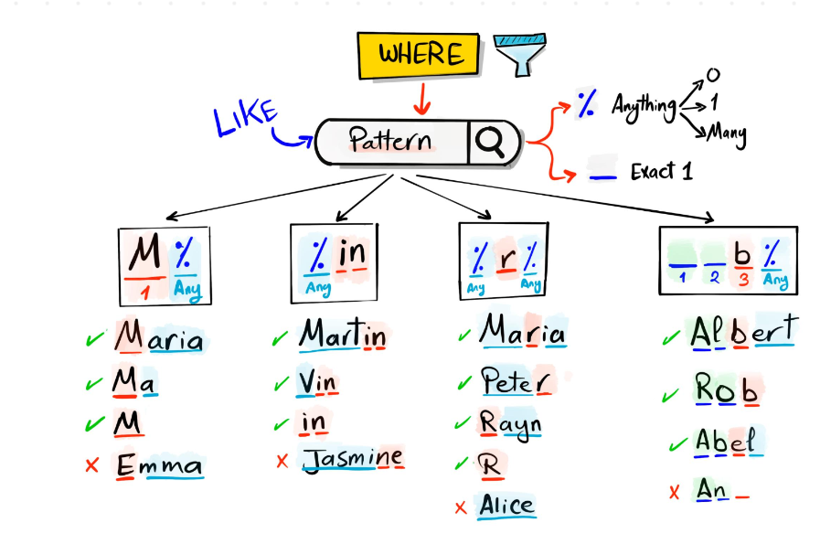


### Combining Data:
-  To combine 2 table:
    Combine **columns**-> JOIN clause--> it joins the columns horizontally
    Combine **rows**->SET operators--> it joins the rows vertically

💡Requirements:-
JOIN requires key for every column
SET doesn;t require one but the number of  columns for both the tables should be same

### Types of JOINS:[BASICS]
- NO JOIN--> don;t join the tables ..get the tables as separate results
- INNER JOIN-->returns only the matching rows from both tables --order of table doesn't matter
- FULL JOIN-->Returns all the rows from both tables

*from now on order of table written in query matters and is very important*
- LEFT JOIN--> returns all the rows from the left table and only the matching from right table
    - Left table becomes the primary source of data  💡Specified in the FROM clause 
    - Right table becomes the secondary source of data 💡Specified latter

- Right join---> this is exactly the opposite that to left join

### Various uses of join commands:
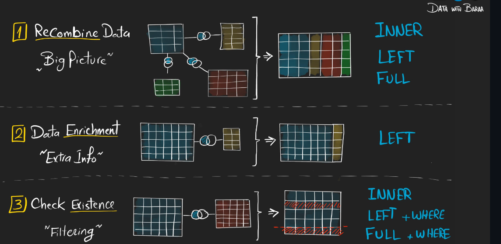


### Advanced JOIN Commands:
1. <u>Left</u> *anti* join: Returns row from <u>left</u> side that has *no match* with right
    -Basically its left + where clause 
    - we use the right table just as a lookup table 
    - and the left one obv as the primary source of data

2. <u>Right</u> *anti* join : returns row from the <u>right</u> side that has *no match* with the left
    -basically its right+where clause
    - we use the left table just as a lookup table 
    - and the right  one obv as the primary source of data
3. Full anti join: returns only the rows that don't match in either tables
    -- ITS FULL +WHERE
    - ORDER NOT IMPORTANT
4. Cross join-combines every row from the left with evrey row from the right
    All possible combinations--> just like cartesian join

### How to choose the correct type of commands[Decision Tree]:
Right join is generaly avoided..it could be done by left join only
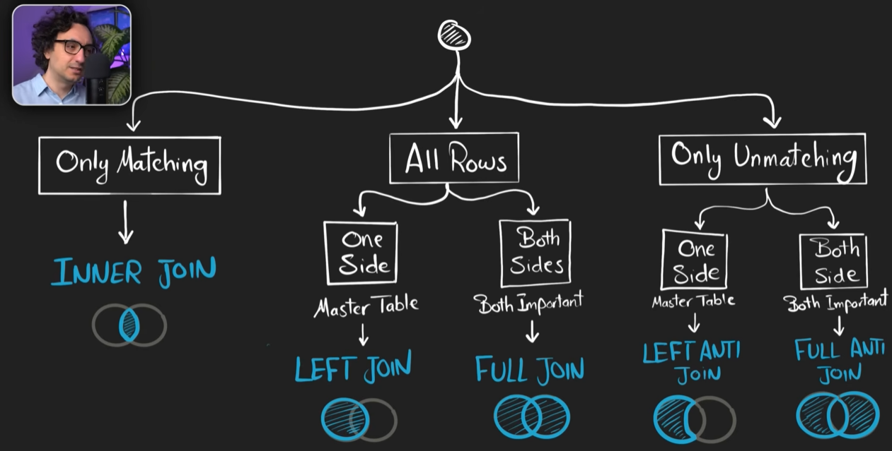           


### joining rows by SET OPERATOR
💡💡 Rules for using SET operator:
    1. SET operator can be used almost in all cases--> WHERE | JOIN | GROUP BY | HAVING
    2. But ORDER BY can be used only once at the end of the query
    3. 💡🚀number of columns in each query must be the same
*Note:* the first query before set operation controls everything...
the data types of the second query must be the same as that of first query  
the order of the columns must also be the same

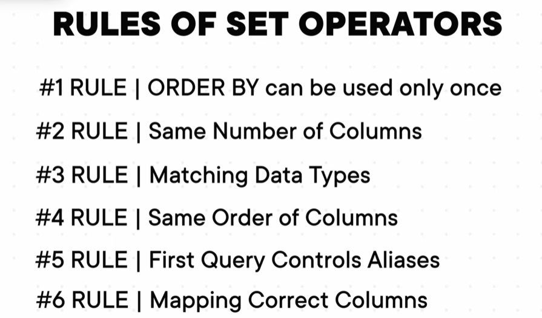

1. Union: 
    - Returns all distinct rows from both queries.
    - Removes duplicate rows from the result.
    - So each row can appear only once
    - 💡 The order of queries in union operation does not affect the result

2. UNION ALL--. FASTER THAN UNION-->since union all doesn't do extra steps like segregating duplicates as is done in UNION
    - returns all rows from both queries , *INCLUDING DUPLICATES*...
    - basically exactly equal to the cartesian product
    - 💡*IT IS USED TO FIND DUPLICATES AND QUALITY ISSUES*

3. EXCEPT:
    - returns all distinct rows from first query that are not found in the second query  -->💡[A-B] in simple terms
    - 💡returns unique rows in the first table which are not in the second table  
    - Hence, order of the queries matters here

4. INTERSECT:
    - returns only the rows which are common in both the tables

## *Best practice: Never use star  ...Specify the required column explicitly for each and every table*

## Use cases of  EXCEPT OPERATOR:
### Delta Detection:
Identifying the difference or changes(delta) between 2 batches of data
- EXCEPT operator is used to do this in real time..
💡Suppose Being a data engineer ew create a pipeline and entry a number of data to the data warehouse..
If by any chance any duplicate data comes in ..then it will be redundant if saved in db..
hence we use EXCEPT to find the difference and then only add it to the db

### Data Completeness check:
- EXCEPT operator is used to compare tables to detect discrepancies b/w databases

### *Summary:* 
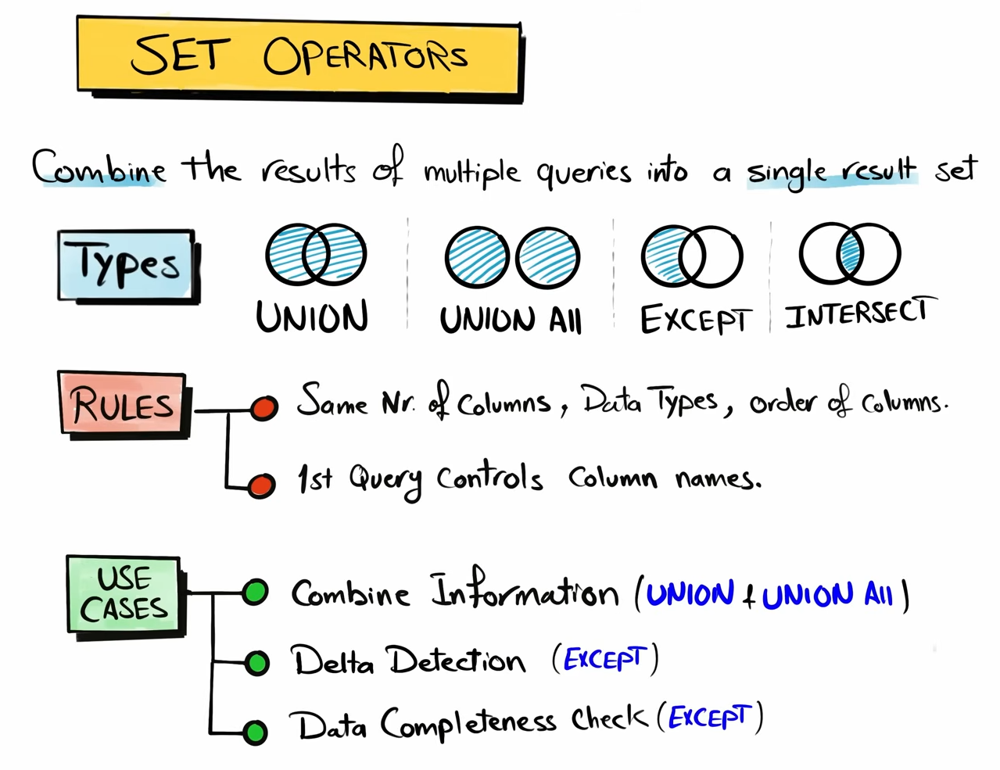

## SQL Functions:
💡 It is a built in SQL code which 
    - accepts an input value
    -processes it
    - returns an output value`

### Types:
1. Single Row Function--> single input , single output  --> Used to do row-level calculations
2. Multi Row Functions--> multiple inputs, single output  --> used to do aggregation

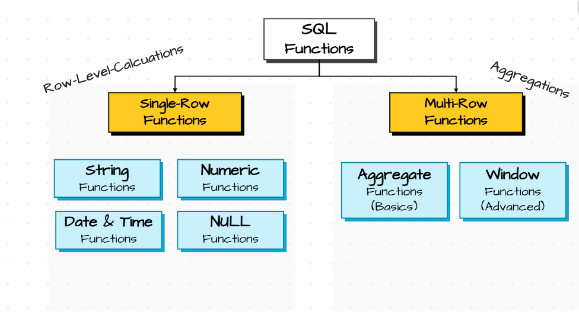


- *Nested functions: functions used inside another function*

## Subtypes of Single row functions:
### 1. String functions:
#### 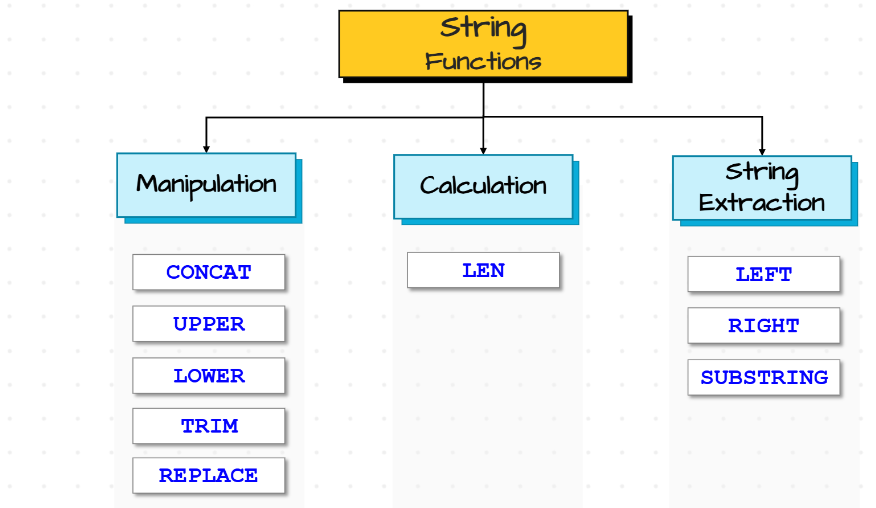
    - Concat-> Combines mnultiple string in one value
    - UPPER and LOWER FUNCTIONS:->self exp
    - TRIM-> removes leading and trailing spaces
    - REPLACE -> removes specific character with a new character
*String exrtaction functions:*
    -LEFT->Extracts specific number of characters from the start
    - RIGHT-> Extracts specific number of characters from the end
        Syntax:  LEFT/RIGHT(value,no.of characters)
        *N.B.:*-> It follows 1-based indexing...that means no of chars=2 means 2 chars extracted...(inclusive)
    - SUBSTRING->Extracts a part of the string from a specified position
        syntax: SUBSTRING(value,start,length) 💡Starting index inclusive 
### 2. Number functions..follow straight from baraa pdf
### 3. Date Time functions:
# 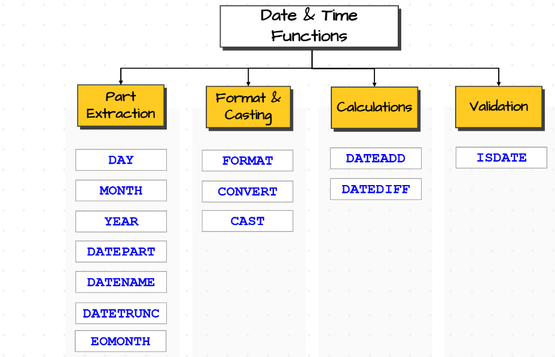

- we can get fetch the date and time by passing a normal query for them
- The most important function used to fetch dates from the  db is: GetDate()
    GETDATE()-->returns the current date and time at the moment when the query is executed


### Use of Part Exrtaction using  Dates and times:?
1.Data Aggregation
2.Data Filtering

# 💡 Best Practice: Filtering data using an integer is faster than using a string
# Hence Avoid using DATENAME for filtering data , instead use DATEPART

## When to use which operator?:
# 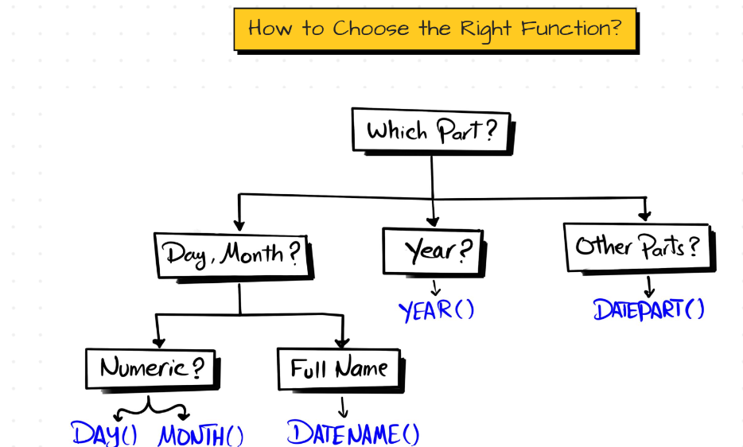


## Date Formatting: 
 - FORMAT-->changing the format of a value from one form to another...changing how the data looks like
    syntax::
    ``` sql
        FORMAT(value,format[,culture])    -- culture is optional
    ```

 - CONVERT--> converts  a data and time value to a different data type and formats the value
    Syntax:

     ``` sql
        CONVERT(data_type,value[,style])    -- culture is optional
    ```

 - CAST-->changing the data type from one to another
     Syntax:

     ``` sql
       CAST(value as data_type)
    ```

## Use Case of Data Formatting:
1. Data Aggregation
2. Data Standardization

### FORMAT vs CONVERT vs CAST:
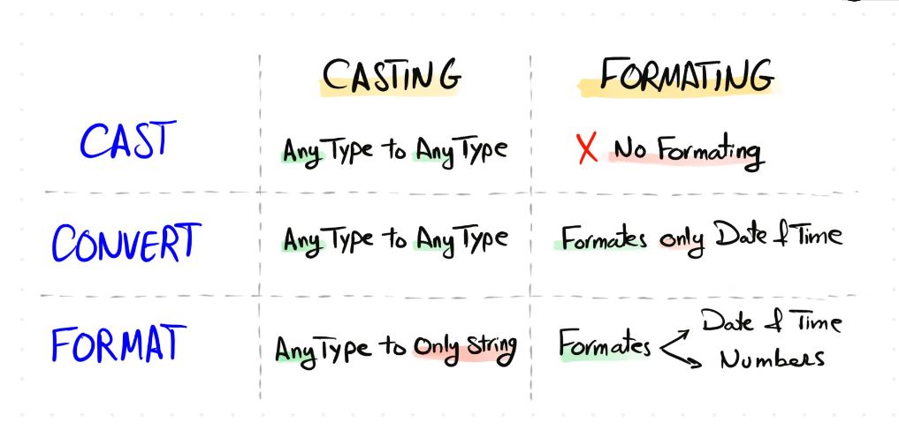

## Date Calculations:
1. DATEADD()-->Adds or substracts a specific time interval to/from a date
    Syntax:

    ``` sql
        DATEADD(part,interval,date)  
    ```

2.DATEDIFF()-->used to find the difference between 2 dates
    Syntax:

    ``` sql
        DATEDIFF(part,start_date,end_date)  
    ```
## Date Validations:
ISDATE(value)--> checks if the value is a date
        - returns 1 if the string value is a valid date


## Null Functions:
- Null means nothing, unknown..
- Null does not mean anything...its neither zero or anything else...

*  NULL  ---> any value  🚀Use ISNULL  | COALESCE
*  Any value ---> NULL   🚀use NULLIF
* To check if the value is NULL or not   🚀Use IS NULL   | IS NOT NULL


1. ISNULL--> Replaces null with a specific value
    Syntax:
    ```sql
    ISNULL(value,replacement_value)
    ```
*🚀Note: Is the value is null, then it will replace it with the replacement_value, else it will return the existing value itself*

2. COALESCE--> returns the first non-null value  from a list
    Syntax:
    ```sql
    COALESCE(value1,value2,value3,...)
    ```
*🚀Note: It checks the values in sequence starting from the first value and then moving onn until it gets non-null value*

3. NULLIF()->comapres two expressions and returns:
    - NULL if they are equal,
    - First Value , if they are not equal
    Syntax:
    ```sql
    NULLIF(value1,value2 )
    ```
### ISNULL vs COALESCE
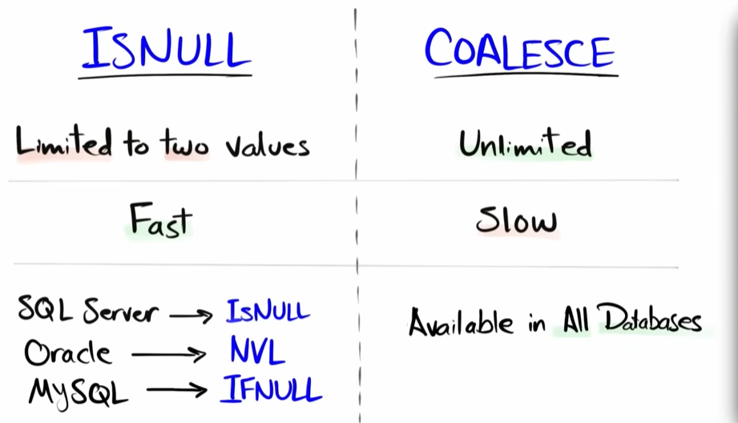

💡 Use case -handing nulls
1. Data Aggregation
    - except COUNT(*) , in all cases the null entry/row gets ignored...
    
2. Mathematical Operations:
    - we can use them to handle the null before doing any mathematical operation.
    eg: NULL + 5 --> would give NULL  --> so here we could have made null as 0 which would be more accurate
        NULL +'B' --> would give NULL --> so here we could have made null as '' which would be more accurate 
3. Joins:
    - We need to handle the nulls bufore joining the tables..so that the result becomes accurate

4.Sorting Data:
    - we need to handle the nulls before sorting the data 


