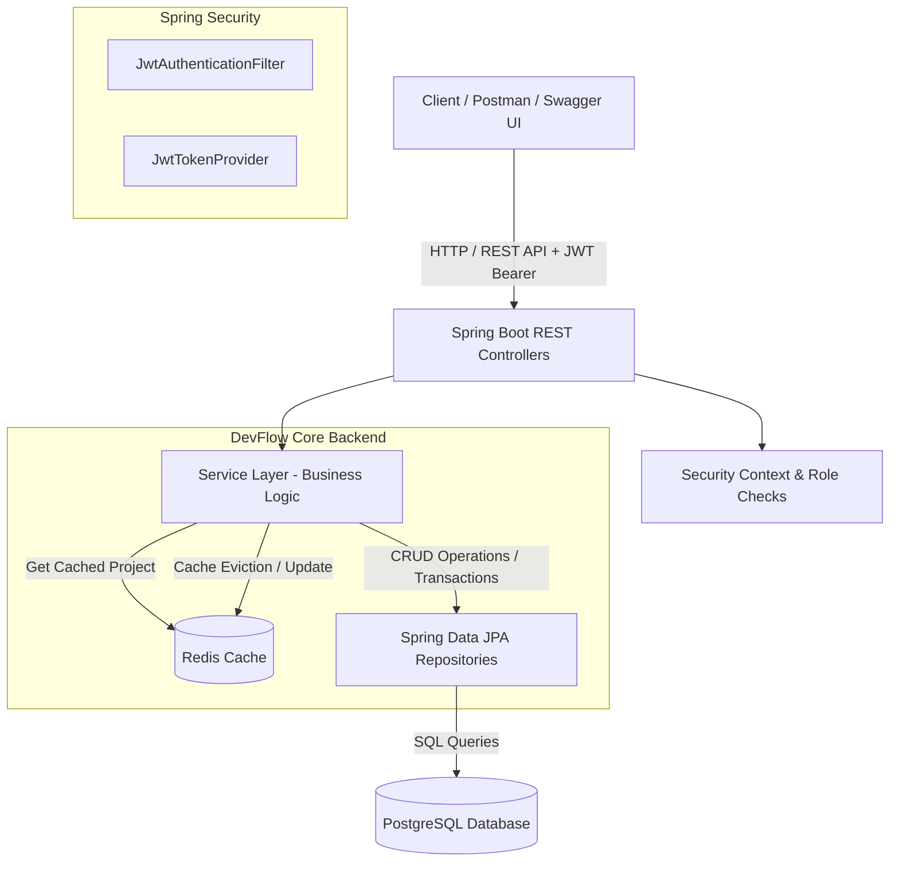

# DevFlow - Developer Task and Incident Management Platform

DevFlow is an intermediate-to-advanced, production-style developer task and incident management backend REST API built with **Java 21**, **Spring Boot 3**, **Spring Data JPA**, **PostgreSQL**, **Spring Security**, **JWT Authentication**, **Redis Caching**, **Jakarta Bean Validation**, **OpenAPI / Swagger**, **Spring Boot Actuator**, **JUnit 5**, and **Mockito**.

---

## 🏛️ Architecture & Project Structure

DevFlow follows a clean layered architecture adhering to SOLID principles and strict separation of concerns:

`Controller Layer (REST Endpoints)` → `Service Layer (Business Logic & Transactions)` → `Repository Layer (Spring Data JPA)` → `PostgreSQL Database / Redis Cache`

```
devflow-backend/
├── src/
│   ├── main/
│   │   ├── java/com/devflow/
│   │   │   ├── DevFlowApplication.java
│   │   │   ├── config/             # Security, Redis, OpenAPI, Sample Data Initializer
│   │   │   ├── controller/         # Auth, Project, Task, Incident, Comment REST Controllers
│   │   │   ├── dto/                # Request & Response DTOs
│   │   │   │   ├── request/
│   │   │   │   └── response/
│   │   │   ├── entity/             # JPA Entities (User, Project, Task, Incident, Comment)
│   │   │   ├── enums/              # Role, Priority, TaskStatus, IncidentSeverity, IncidentStatus
│   │   │   ├── exception/          # Global Exception Handler & Custom Exceptions
│   │   │   ├── mapper/             # Entity to DTO Mappers
│   │   │   ├── repository/         # Spring Data JPA Repositories
│   │   │   ├── security/           # JWT Token Provider, UserPrincipal, Filters, Security Config
│   │   │   └── service/            # Interfaces and Implementation Services
│   │   │       └── impl/
│   │   └── resources/
│   │       ├── application.yml
│   │       ├── application-dev.yml
│   │       └── application-prod.yml
│   └── test/                       # Service Unit Tests and Controller MockMvc Tests
│       └── java/com/devflow/
│           ├── controller/
│           └── service/
├── Dockerfile                      # Multi-stage Java 21 build
├── docker-compose.yml              # App + PostgreSQL 16 + Redis 7
├── pom.xml                         # Maven dependencies & build configuration
├── .env.example                    # Environment variable template
└── README.md
```

### System Architecture Diagram (Mermaid)



---

## 🛠️ Technology Stack

* **Language**: Java 21
* **Framework**: Spring Boot 3.2.4
* **Security**: Spring Security & JJWT (JSON Web Token 0.12.5)
* **Data Persistence**: Spring Data JPA & Hibernate 6
* **Database**: PostgreSQL 16
* **Cache**: Spring Data Redis 7
* **API Documentation**: OpenAPI 3.0 / Swagger UI (springdoc-openapi)
* **Monitoring**: Spring Boot Actuator (`/actuator/health`, `/actuator/info`)
* **Utilities**: Lombok, Jakarta Bean Validation
* **Build & Containerization**: Maven, Docker, Docker Compose
* **Testing**: JUnit 5, Mockito, Spring Security Test, Testcontainers

---

## 🔒 Role-Based Access Control (RBAC)

DevFlow enforces strict authorization boundaries:

* **ADMIN**:
  * Full user management & role administration
  * Create, update, and delete all projects
  * Full access to all tasks, incidents, and comments
* **MANAGER**:
  * Create projects and manage owned projects
  * Create tasks and assign them to developers
  * Create and assign incidents
  * View project analytics & tasks
* **DEVELOPER** *(Default assigned role)*:
  * View assigned projects
  * Update assigned task status (`TODO` → `IN_PROGRESS` → `REVIEW` → `DONE`)
  * Add comments to tasks
  * Report incidents/bugs

---

## 🔑 Environment Variables

Copy `.env.example` to `.env` or set environment variables in your deployment shell:

| Environment Variable | Description | Default Value |
|---|---|---|
| `DB_HOST` | PostgreSQL Database Host | `localhost` / `devflow-db` |
| `DB_PORT` | PostgreSQL Database Port | `5432` |
| `DB_NAME` | Database Name | `devflow_db` |
| `DB_USERNAME` | Database Username | `devflow_user` |
| `DB_PASSWORD` | Database Password | `devflow_secure_password` |
| `REDIS_HOST` | Redis Host | `localhost` / `devflow-redis` |
| `REDIS_PORT` | Redis Port | `6379` |
| `JWT_SECRET` | 256-bit Secret Key for signing JWTs | `404E635266556A586E3272357538782F413F4428472B4B6250645367566B5970` |
| `JWT_EXPIRATION_MS` | Token Expiration in Milliseconds | `86400000` (24 Hours) |
| `PORT` | Spring Boot HTTP Server Port | `8080` |

---

## 🚀 Running the Application

### Option A: Running with Docker Compose (Recommended)

1. Start all containers (Application, PostgreSQL 16, Redis 7):

```bash
docker-compose up --build
```

2. Access the application at `http://localhost:8080`.
3. Open Swagger UI at `http://localhost:8080/swagger-ui.html`.

---

### Option B: Local Development Setup

#### Prerequisites
* JDK 21
* Maven 3.9+
* PostgreSQL running on port 5432
* Redis running on port 6379

1. Build the application:

```bash
mvn clean package -DskipTests
```

2. Run the application with the `dev` profile (enables sample data initialization):

```bash
mvn spring-boot:run -Dspring-boot.run.profiles=dev
```

---

## 🧪 Running Tests

Execute all unit and controller MockMvc tests:

```bash
mvn clean test
```

---

## ⚡ Default Sample Development Users

When started with the `dev` profile, DevFlow automatically seeds sample accounts (Password: `Password123!`):

* **ADMIN**: `admin@devflow.com`
* **MANAGER**: `manager@devflow.com`
* **DEVELOPERS**: `charlie@devflow.com`, `diana@devflow.com`

---

## 📡 API Endpoints Summary

### Authentication
* `POST /api/auth/register` - Register a new user (`DEVELOPER` role by default)
* `POST /api/auth/login` - Authenticate and obtain JWT bearer token

### Projects (`/api/projects`)
* `POST /api/projects` - Create project (*ADMIN, MANAGER*)
* `GET /api/projects` - List all accessible projects
* `GET /api/projects/{id}` - Get project details (*Redis Cached*)
* `PUT /api/projects/{id}` - Update project details (*Evicts Redis Cache*)
* `DELETE /api/projects/{id}` - Delete project (*ADMIN only, Evicts Cache*)
* `GET /api/projects/{id}/tasks` - List project tasks with pagination, sorting & filtering
* `GET /api/projects/{id}/incidents` - List project incidents with filtering

### Tasks (`/api/tasks`)
* `POST /api/tasks` - Create task (*ADMIN, MANAGER*)
* `GET /api/tasks/{id}` - Get task details
* `PUT /api/tasks/{id}` - Update task details
* `DELETE /api/tasks/{id}` - Delete task (*ADMIN, MANAGER*)
* `PATCH /api/tasks/{id}/status` - Update task status (`TODO`, `IN_PROGRESS`, `REVIEW`, `DONE`, `CANCELLED`)
* `PATCH /api/tasks/{id}/assign` - Assign task to user (*ADMIN, MANAGER*)

### Incidents (`/api/incidents`)
* `POST /api/incidents` - Report bug or incident
* `GET /api/incidents/{id}` - Get incident details
* `PUT /api/incidents/{id}` - Update incident details
* `DELETE /api/incidents/{id}` - Delete incident
* `PATCH /api/incidents/{id}/status` - Update incident status (`OPEN`, `INVESTIGATING`, `RESOLVED`, `CLOSED`)
* `PATCH /api/incidents/{id}/assign` - Assign incident (*ADMIN, MANAGER*)

### Task Comments (`/api/comments`)
* `POST /api/tasks/{taskId}/comments` - Add comment to task
* `GET /api/tasks/{taskId}/comments` - Get comments for task
* `DELETE /api/comments/{commentId}` - Delete comment (*Author or ADMIN*)

---

## 📖 Swagger / OpenAPI Documentation

Explore interactive documentation and test API endpoints directly in your browser:
* **URL**: `http://localhost:8080/swagger-ui.html`
* Click **Authorize** button in Swagger UI and input `Bearer <your_jwt_token>` to test authenticated endpoints.

---

## 🩺 Actuator Monitoring
* **Health Check**: `GET http://localhost:8080/actuator/health`
* **Application Info**: `GET http://localhost:8080/actuator/info`
