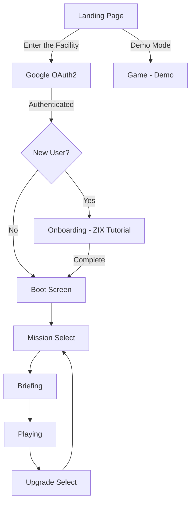

# OVERCLOCK — Software Architecture

## 1. Application Flow


## 2. Directory Structure
```text
server.ts                   # Express backend for Google OAuth2 authentication
src/
├── game/
│   ├── types.ts              # Core TypeScript interfaces, enums, type definitions
│   ├── auth/
│   │   └── AuthContext.tsx   # React context for authentication state
│   ├── audio/
│   │   └── SoundSynth.ts     # Procedural Web Audio API sound generator & audio bus
│   ├── data/
│   │   ├── weapons.ts        # Data-driven weapon profiles & mechanics
│   │   ├── upgrades.ts       # Roguelite upgrade definitions & synergies
│   │   ├── missions.ts       # 5 Core missions + Boss + Endless Overdrive
│   │   └── secrets.ts        # Secrets, easter eggs, terminal commands
│   ├── entities/
│   │   ├── Player.ts         # VX-01 Player combat entity (movement, physics, rendering)
│   │   ├── Enemy.ts          # Enemy entities (Drone, Charger, Turret, Leech, Hacker)
│   │   ├── Boss.ts           # 4-Phase Administrator boss & sub-systems
│   │   ├── Projectile.ts     # Player & Enemy ballistic/beam/missile projectiles
│   │   └── Particle.ts       # Sparks, smoke, shockwaves, thermal vents, floating numbers
│   └── systems/
│       ├── GameEngine.ts     # Master engine, game loop, input, physics, state coordinator
│       ├── OnboardingSystem.ts # Tutorial state machine with ZIX guide
│       ├── PowerSystem.ts    # Reactor power router (Weapons/Engine/Shield/Cooling)
│       └── TacticalAI.ts     # Local deterministic tactical commentary generator
├── components/
│   ├── LandingPage.tsx       # Story-driven public landing page
│   ├── AuthScreen.tsx        # Authentication UI (loading, granted, error, user badge)
│   ├── OnboardingOverlay.tsx # Tutorial overlay with ZIX dialogue
│   ├── ZIXCharacter.tsx      # ZIX guide character SVG avatar
│   ├── GameCanvas.tsx        # High-performance 60fps Canvas viewport
│   ├── BootScreen.tsx        # Retro-futuristic military OS boot sequence
│   ├── HudOverlay.tsx        # Military OS telemetry HUD with diagnostics
│   ├── PowerRouter.tsx       # Real-time power distribution sliders
│   ├── UpgradeModal.tsx      # Roguelite upgrade choice interface
│   ├── GameOverModal.tsx     # Diagnostic autopsy & witty failure screen
│   ├── VictoryModal.tsx      # Mission/Campaign debrief & stats review
│   └── TerminalDrawer.tsx    # In-game hidden command console
├── App.tsx                   # Main React container coordinating scenes & UI
├── main.tsx                  # Vite React entry point (with AuthProvider)
└── index.css                 # Military retro Tailwind styling & scanlines
```

## 3. Separation of Concerns
* **Backend (`server.ts`)**: Express server for Google OAuth2 authentication, session management, and static file serving in production.
* **Simulation Layer (`/game/`)**: Independent TypeScript classes and systems. Runs deterministically on requestAnimationFrame with delta-time integration.
* **Rendering Layer (`GameCanvas.tsx`)**: High performance 2D Canvas context rendering entities, bullet trails, arena grid, camera shake, thermal distortion, and particle buffers.
* **Telemetry & UI Layer (`/components/`)**: React overlays reflecting snapshot telemetry without polluting the canvas rendering hot path.
* **Audio Layer (`SoundSynth.ts`)**: Pure Web Audio API synthesized soundscape (oscillators, noise generators, filters) with zero external asset latency or missing file risks.
* **Auth Layer (`/game/auth/`)**: React context for Google OAuth2 session state management.
* **Onboarding Layer**: Tutorial state machine (`OnboardingSystem`) + UI overlay (`OnboardingOverlay`) + guide character (`ZIXCharacter`).
