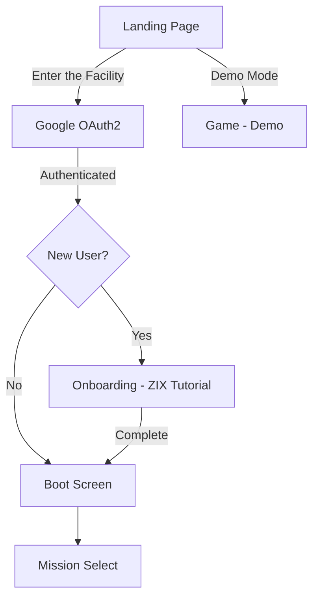

# OVERCLOCK — AI Engineering & Contributor Handoff (FREEBUFF_HANDOFF.md)

## 1. Game Overview
OVERCLOCK is a browser-based combat roguelite. The player controls the experimental VX-01 combat machine in high-stakes top-down combat. The central mechanic is **OVERCLOCK** (triggered by Q), which grants immense firepower and speed while accelerating heat generation towards catastrophic meltdown at 100%.

## 2. Current Development Stage
**Final Productization Pass (v1.0.0)**:
- Fully playable 5-mission progression + multi-phase Administrator boss fight + Endless Overdrive mode.
- Google OAuth2 authentication via Express backend.
- Story-driven public landing page with game narrative.
- First-time player onboarding with ZIX guide character.
- Interactive tutorial teaching all core mechanics using real game systems.
- Rebalanced player survivability (+30% Core HP, +20% Shield).
- Centralized game balance configuration in `/src/game/data/balanceConfig.ts` (`GAME_BALANCE`).

## 3. Technology Stack
- **TypeScript**: Pure types, modular classes, no global pollution.
- **HTML5 Canvas (2D)**: 60 FPS gameplay rendering, particle systems, dynamic lighting effects, and laser beams.
- **React 19 & Tailwind CSS**: Monospace military OS HUD and diagnostic dialogs.
- **Web Audio API**: Procedural sound synthesis requiring no external audio file downloads.
- **Express**: Backend server for Google OAuth2 authentication.
- **express-session**: Server-side session management.

## 4. Architectural Layout
```text
server.ts                   # Express OAuth2 backend (NEW)
src/
├── game/
│   ├── types.ts              # Central data contracts and state types
│   ├── auth/AuthContext.tsx   # React auth context (NEW)
│   ├── audio/SoundSynth.ts   # Web Audio procedural sound generator
│   ├── data/
│   │   ├── balanceConfig.ts  # Single-point-of-truth game balance (GAME_BALANCE)
│   │   ├── weapons.ts        # Weapon definitions & loadouts
│   │   ├── weaponMods.ts     # Weapon mod sockets & attachments
│   │   ├── missions.ts       # Campaign missions & wave definitions
│   │   ├── upgrades.ts       # Roguelite upgrade definitions
│   │   ├── endlessMutations.ts # Endless mode mutations
│   │   └── secrets.ts        # Terminal commands & secrets
│   ├── entities/             # Player, Enemy, Boss, Projectile, Particle
│   └── systems/
│       ├── GameEngine.ts     # Master engine, game loop, state coordinator
│       ├── OnboardingSystem.ts # Tutorial state machine (NEW)
│       ├── PowerSystem.ts    # Reactor power router
│       ├── TacticalAI.ts     # Tactical commentary generator
│       ├── SaveSystem.ts     # localStorage persistence
│       └── OperatorProfileSystem.ts # Player profile & archetype
├── components/
│   ├── LandingPage.tsx       # Story-driven landing page (NEW)
│   ├── AuthScreen.tsx        # Auth UI components (NEW)
│   ├── OnboardingOverlay.tsx # Tutorial overlay (NEW)
│   ├── ZIXCharacter.tsx      # ZIX guide character SVG (NEW)
│   ├── GameCanvas.tsx        # 60fps Canvas viewport
│   ├── BootScreen.tsx        # Boot sequence (extended: Replay Tutorial)
│   ├── PauseModal.tsx        # Pause overlay (extended: Logout)
│   └── ... (existing modals unchanged)
├── App.tsx                   # Main container (extended: auth, landing, onboarding)
└── main.tsx                  # Entry point (extended: AuthProvider)
```

## 5. Application Flow


## 6. Authentication Architecture
- **Provider**: Google OAuth2 (Authorization Code Grant)
- **Backend**: Express server (`server.ts`) on port 3001
- **Sessions**: `express-session` with cookie-based session IDs
- **Frontend**: React `AuthContext` for state management
- **Environment Variables**: `GOOGLE_CLIENT_ID`, `GOOGLE_CLIENT_SECRET`, `AUTH_REDIRECT_URI`, `SESSION_SECRET`
- **Setup**: See `/docs/AUTHENTICATION.md`

## 7. Onboarding Architecture
- **System**: `OnboardingSystem` singleton state machine
- **Character**: ZIX — SVG holographic alien with mood states
- **Steps**: 10 interactive steps teaching all core mechanics
- **Persistence**: localStorage (`OVERCLOCK_TUTORIAL_STATE`)
- **Skip/Replay**: Available on every step and from Boot Screen
- **Setup**: See `/docs/ONBOARDING.md`

## 8. Landing Page Architecture
- **Component**: `LandingPage.tsx` — pure HTML/CSS, no canvas
- **Sections**: Hero, Story (5 panels), Gameplay Pillars, Final CTA
- **Flow**: Enter the Facility → OAuth, Demo Mode → direct to game
- **Visual**: Matches game's sci-fi facility terminal aesthetic
- **Setup**: See `/docs/LANDING_PAGE.md`

## 9. Critical Features That Must NOT Be Broken
1. **Heat & Meltdown Physics**: Heat must ramp up on firing/dashing and dissipate via cooling. 100% heat MUST trigger the Meltdown death sequence.
2. **Supercritical Secret Window**: Activating Overclock between 95% and 99% heat triggers the 3-second Supercritical Zero-Heat bonus.
3. **Audio Synthesis**: The sound engine uses Web Audio API oscillators; do not replace it with hardcoded broken file paths.
4. **Power Routing Math**: Sum of power across WEAPONS + ENGINE + SHIELD + COOLING must always equal 100%.
5. **Centralized Balance**: All entity and gameplay adjustments MUST be sourced from `GAME_BALANCE` in `balanceConfig.ts`.
6. **Authentication**: Google OAuth2 flow must work end-to-end. Session management must be secure.
7. **Onboarding**: Tutorial must use REAL game systems. No duplicate implementations.
8. **Landing Page**: Must match game's visual language. No generic SaaS styling.

## 10. Important Files
| File | Purpose | Must Not Rewrite |
|------|---------|------------------|
| `server.ts` | OAuth2 backend | Core auth flow |
| `src/game/auth/AuthContext.tsx` | Auth state | Auth provider |
| `src/game/systems/OnboardingSystem.ts` | Tutorial logic | Step definitions |
| `src/components/LandingPage.tsx` | Landing page | Story content |
| `src/game/systems/GameEngine.ts` | Game engine | All gameplay |
| `src/game/data/balanceConfig.ts` | Balance | All tuning values |
| `src/game/entities/Player.ts` | Player entity | Core mechanics |

## 11. How to Test
### Full Flow (with Google OAuth)
1. Set up Google OAuth2 credentials in `.env`
2. Run `npm run server` (auth server on port 3001)
3. Run `npm run dev` (frontend on port 3000)
4. Open http://localhost:3000 — Landing page appears
5. Click "Enter the Facility" — Google OAuth flow
6. New user → ZIX tutorial → Mission 01
7. Returning user → Boot Screen → Mission Select

### Demo Mode (no auth needed)
1. Run `npm run dev`
2. Open http://localhost:3000
3. Click "Demo Mode" on landing page
4. Game starts in demo mode

### Regression
1. Complete all 6 missions
2. Test Overclock at 95-99% heat (supercritical)
3. Test all terminal commands
4. Test power routing presets
5. Test weapon modding
6. Test Endless Overdrive
7. Test pause/resume
8. Test mute toggle

